<div align="center">

<!-- Animated Header Wave -->


<!-- Animated Typing SVG -->
<a href="https://git.io/typing-svg">
  
</a>

<br/>

<!-- Animated Badges -->


<br/><br/>

<!-- Glowing Line Divider -->


</div>

##  **About This Project**

> 🛸 *A powerful Python script that automates your GitHub activity — smart, fast, and fully customizable.*

<div align="center">
<table>
<tr>
<td align="center">

<br><b>⚡ Fast</b>
<br><sub>Minutes to setup</sub>
</td>
<td align="center">

<br><b>🎨 Customizable</b>
<br><sub>Full control</sub>
</td>
<td align="center">

<br><b>🔧 Simple</b>
<br><sub>One command</sub>
</td>
<td align="center">

<br><b>🐍 Python</b>
<br><sub>Clean code</sub>
</td>
</tr>
</table>
</div>


##  **⚠️ Disclaimer**

<div align="center">

```
╔══════════════════════════════════════════════════════════╗
║  📚  FOR EDUCATIONAL PURPOSES ONLY                      ║
║  🚫  Do NOT misrepresent professional contributions     ║
║  ✅  Learn how GitHub mechanics work                     ║
╚══════════════════════════════════════════════════════════╝
```

</div>


##  **🚀 Quick Start**

<details>
<summary><b>🔥 Click to Expand — Get Started in 60 Seconds!</b></summary>
<br/>

**1️⃣ Create an empty GitHub repository** (Do not initialize it with a README)

**2️⃣ Run the script** with your repository URL:

```bash
# Using SSH 🔐
python contribute.py --repository=git@github.com:yourusername/repo.git
```

```bash
# Using HTTPS 🌐
python contribute.py --repository=https://github.com/yourusername/repo.git
```

> 💡 **Pro Tip:** It takes several minutes for GitHub to reindex your activity.

</details>


##  **🎨 Customization Options**

<details>
<summary><b>🎯 Basic Usage</b></summary>

```bash
# Make 1-12 commits per day, 60% of the days
python contribute.py --max_commits=12 --frequency=60 --repository=git@github.com:user/repo.git
```
</details>

<details>
<summary><b>📅 Skip Weekends</b></summary>

```bash
python contribute.py --no_weekends --repository=git@github.com:user/repo.git
```
</details>

<details>
<summary><b>📆 Specify Date Range</b></summary>

```bash
# Start from 10 days ago and continue for 15 days into the future
python contribute.py --days_before=10 --days_after=15 --repository=git@github.com:user/repo.git
```
</details>

<details>
<summary><b>👤 Custom Git Config</b></summary>

```bash
python contribute.py --user_name="Your Name" --user_email="your@email.com" --repository=git@github.com:user/repo.git
```
</details>


##  **📋 All Available Options**

<div align="center">

| 🏷️ Option | 📝 Description | 🔧 Default |
|:---:|:---|:---:|
| `-r, --repository` | Remote repository URL (SSH or HTTPS) | `None` |
| `-mc, --max_commits` | Maximum commits per day (1-20) | `10` |
| `-fr, --frequency` | Percentage of days to commit (0-100) | `80` |
| `-nw, --no_weekends` | Skip commits on weekends | `False` |
| `-db, --days_before` | How many days before today to start | `365` |
| `-da, --days_after` | How many days after today to continue | `0` |
| `-un, --user_name` | Override git user.name | `Global config` |
| `-ue, --user_email` | Override git user.email | `Global config` |

```mermaid
graph LR
    A[🚀 Start] --> B[📁 Init Repo]
    B --> C[📝 Create README]
    C --> D[🔄 Generate Commits]
    D --> E[🔗 Link Remote]
    E --> F[📤 Push to GitHub]
    F --> G[✅ Done!]
    
    style A fill:#FF6B6B,stroke:#333,color:#fff
    style B fill:#FFA07A,stroke:#333,color:#fff
    style C fill:#FFD700,stroke:#333,color:#000
    style D fill:#00CED1,stroke:#333,color:#fff
    style E fill:#7B68EE,stroke:#333,color:#fff
    style F fill:#FF69B4,stroke:#333,color:#fff
    style G fill:#32CD32,stroke:#333,color:#fff
```

</div>


##  **🔧 How It Works**

<div align="center">



</div>

**The script performs these steps:**

```
 ① ➜ Initializes an empty git repository
 ② ➜ Creates a README.md file
 ③ ➜ Generates random commits for the specified date range
 ④ ➜ Links the repository with your remote GitHub repository
 ⑤ ➜ Pushes all changes to GitHub
```


##  **📝 Requirements**

<div align="center">


</div>

<br/>

| Requirement | Version |
|:---:|:---:|
| 🐍 Python | 3.x+ |
| 🔀 Git | Latest |


##  **🐛 Troubleshooting**

<details>
<summary><b>😕 Activity not showing up?</b></summary>
<br/>

- ⏳ Wait a few minutes for GitHub to reindex
- 🔒 Check if your repository is private — [enable showing private contributions](https://help.github.com/en/articles/publicizing-or-hiding-your-private-contributions-on-your-profile)
- 📧 Verify your email in GitHub matches your local git config:
  ```bash
  git config --get user.email
  ```
  If it doesn't match, update it:
  ```bash
  git config --global user.email "your@email.com"
  ```
</details>

<details>
<summary><b>❓ Getting Help</b></summary>

```bash
python contribute.py --help
```
</details>


##  **⭐ Show Your Support**

<div align="center">

If you found this project helpful, give it a ⭐ — it means a lot!

<a href="https://github.com/riturajkumar">
  
</a>

</div>

<br/>

## 📜 License

<div align="center">

```
Apache-2.0 License
```

</div>

<!-- Animated Footer Wave -->


<div align="center">

<!-- Animated Heart -->


<br/>

**Made with ❤️ by [Rituraj Kumar](https://github.com/riturajkumar)**

<a href="https://git.io/typing-svg">
  
</a>

<br/>


</div>